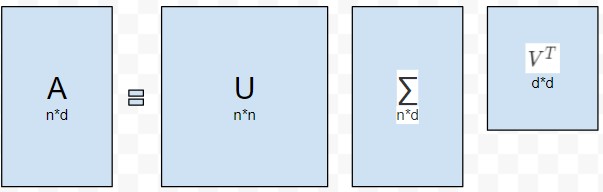
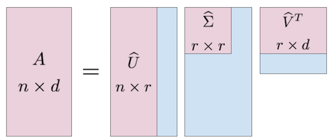

### 从LSA到LDA
#### 一、LSA潜在语义分析
##### 1. 前身
LSA，全称 **潜在语义分析**（Latent Semantic Analysis），是在1990年被提出来的一种新的索引和检索方法。在此之前，信息检索使用的一般是 **向量空间模型**。向量空间模型把文本文件表示为标识符向量的代数模型，假设词典中一共有 $n$ 个词，我们可以把一篇文档映射为一个向量$d_j=(v_{1j},v_{2j},...,v_{nj})$，其中对应的数值为该词组的权重，通常采用的是tf-idf权重。
tf-idf算法认为，对区别文档最有意义的词语应该是那些在文档中出现频率高，而在整个文档集合的其他文档中出现频率少的词语，所以特征空间坐标系取词频tf（term frequency），就可以体现同类文本的特点。考虑单词区别不同类别的能力，tf-idf算法认为一个单词出现的文本频数越小，它区别不同类别文本的能力就越大，因此引入了逆文本频度idf（inverse document frequency），以tf和idf的乘积作为特征空间坐标系的取值测度。
向量空间模型计算各文档间的相似度，只需要计算文档间向量的余弦，如果余弦为零，则表示查询向量和文档向量正交，即不符合。这种模型具有一些优点，比如允许局部匹配，且文档和查询之间相似度取值是连续的，允许根据文档间可能的相关性进行排序等，但局限也很明显，由于过高的维数，它不适用于较长的文档，检索词组必须与文档中出现的词组精确匹配，语义敏感度不佳，具有相同语境但使用词组不同的文档无法被关联等
##### 2. LSA概述
LSA在向量空间模型的基础上做了一些改进，它的基本假设是，如果两个词多次出现在同一文档中，则这两个词在语义上具有相似性。与向量空间模型相同，其也使用向量语义空间来提取文档与词中的“概念”。LSA使用词-文档矩阵（Occurences Matrix）来描述词语在文档中的出现，每一行代表一个文档向量，列代表一个词语，数值依然采用tf-idf权重，然后在此矩阵上使用奇异值分解（singular value decomposition），在保留列信息的情况下减少矩阵行数，之后每两个词语的相似性可以通过其行向量的余弦表示，越接近1说明两个词语越近似，越接近于0说明越不相似。
- SVD原理
SVD即奇异值分解，可以理解为将一个比较复杂的矩阵用更小更简单的3个子矩阵的相乘表示，这3个小矩阵描述了原矩阵的重要特性，对于维度大但又稀疏的矩阵，可以很好地起到降维提取特征的作用

其中$\sum$是一个对角矩阵，主对角线即为奇异值，在很多情况下，前10%甚至1%的奇异值的和就占了全部的奇异值之和的99%以上了，所以可以用前r大的奇异值来近似描述矩阵，于是有 **部分奇异值分解**：
$$A_{n \times d}\approx U_{n \times r} \Sigma_{r \times r}V^T_{r \times d}$$

右边三个矩阵相乘的结果将会是一个接近于A的矩阵，然而这三个矩阵的面积之和远小于原始的矩阵A，取这三个矩阵作为原矩阵的低阶近似
- LSA原理
LSA主要就是使用了SVD的方法， 先构建词-文档矩阵，然后在此矩阵上使用奇异值分解，选取合适的r值进行低阶近似，用降维后的矩阵来进行分析。三个矩阵有非常清楚的物理含义。第一个矩阵中的每一行表示意思相关的一类词（主题），其中的每个非零元素表示这类词中每个词的重要性（或者说相关性），数值越大越相关。最后一个矩阵中的每一列表示同一主题一类文章，其中每个元素表示这类文章中每篇文章的相关性。中间的矩阵则表示类词和文章类之间的相关性。因此，我们只要对关联矩阵A进行一次奇异值分解，我们就可以同时完成了近义词分类和文章的分类
##### 3. LSA理解
相较于向量空间模型，LSA具有很多优点。在传统的向量空间模型中，一个概念只能由一个词来表达。只有精确的字词可以匹配，如果不包含这个特定的词汇，即使意思相近也认为无关，这显然不符合常理，一个概念完全可能由多个词来表达。当用不同词来表达同一概念时，就会有一些偏差，就是噪声。SVD的一个作用就是去除噪声，对矩阵进行部分奇异值分解，就保留了主要方向。从结果上来理解，LSA就是把原来的空间映射到概念空间，svd之后，每一个词汇在这个空间中都有坐标（最左边矩阵的每一行），每一篇文档也有坐标（最右边矩阵的每一列）。在这个概念空间中，具有相同概念的词汇/文档距离相近。LSA潜在语义分析的目的，就是要找出词(terms)在文档和查询中真正的含义，也就是潜在语义。LSA可以解决一义多词和语义关联的情况，但是对一个词表达多个概念就无能为力了。
LSI是最早出现的主题模型，它的算法原理很简单，一次奇异值分解就可以得到主题模型，同时解决词义的问题，非常漂亮。但是LSI有很多不足，导致它在当前实际的主题模型中已基本不再使用。
主要的问题有：
1. SVD计算非常的耗时，尤其是我们的文本处理，词和文本数都是非常大的，对于这样的高维度矩阵做奇异值分解是非常难的
2. 主题值的选取对结果的影响非常大，很难选择合适的k值
3. LSI得到的不是一个概率模型，缺乏统计基础，结果难以直观的解释。
对于问题1，主题模型非负矩阵分解（NMF）可以解决矩阵分解的速度问题。
对于问题2，大部分主题模型的主题的个数选取一般都是凭经验的，较新的层次狄利克雷过程（HDP）可以自动选择主题个数
对于问题3，前人们整出了pLSI(也叫pLSA)和隐含狄利克雷分布(LDA)这类基于概率分布的主题模型来替代基于矩阵分解的主题模型。
回到LSI本身，对于一些规模较小的问题，如果想快速粗粒度的找出一些主题分布的关系，则LSI是比较好的一个选择，其他时候，如果需要使用主题模型，推荐使用LDA和HDP。
