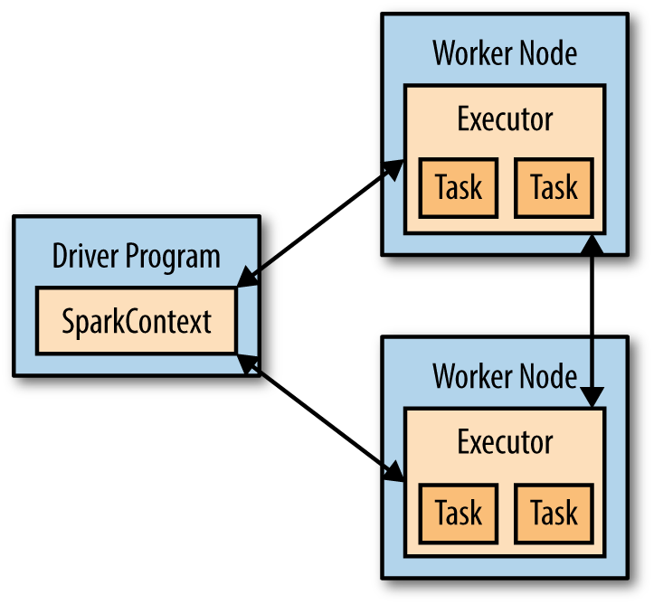

### Chapter2. Downloading Spark and Getting Started
#### Downloading Spark
- Visit https://spark.apache.org/downloads.html, select the package type matching Hadoop version on your machine, and download package.
- Unpack the package with `tar` or any other tools.
    ```
    tar -xf spark-2.2.0-bin-hadoop2.7.tgz
    ```
- We will run Spark in *local mode* first; that is, nondistributed mode, which uses only a single machine. Beyond local mode, Spark can also be run on Mesos, YARN, or the Standalone Scheduler included in the Spark distribution.
#### Introduction to Spark's Python and Scala Shells
- To open the Python version of the Spark shell, which we also refer to as the PySpark Shell, go into your Spark directory and type:
`bin/pyspark`
To open the Scala version of the shell, type:
`bin/spark-shell`
- You can control the verbosity of the logging by creating a file in the *conf* directory called `log4j.properties`. To make the logging less verbose, make a copy of `conf/log4j.properties.template` called `conf/log4j.properties` and find the following line:
`log4j.rootCategory=INFO, console`
Then lower the log level so that we show only the WARN messages, and above by changing it to the following:
`log4j.roorCategory=WARN, console`
- Before we say more about RDDs, let’s create one in the shell from a local text file and do some very simple ad hoc analysis by following two examples
    - Example 2-1. Python line count
        ``` Python
        >>> lines = sc.textFile("README.md")    # Create an RDD called lines
        >>> lines.count()    # Count the number of items in this RDD
        103
        >>> lines.first()    # First item in this RDD, i.e. first line of README.md
        u'# Apache Spark'
        ```
    - Example 2-2. Scala line count
        ``` Scala
        scala> val lines = sc.textFile("README.md")
        lines: org.apache.spark.rdd.RDD[String] = README.md MapPartitionsRDD[1] at textFile at <console>:24

        scala> lines.count()
        res0: Long = 103

        scala> lines.first()
        res1: String = # Apache Spark
        ```
#### Introduction to Core Spark Concepts
- Spark application consists of a ***driver program*** that launches various parallel operations on a cluster.
    - The driver program contains applications's **main** function and defines distributed datasets on the parallel operations on a cluster.
    - In the preceding examples, the driver program is the Spark shell itself.
- Driver programs access Spark through a **SparkContext** object, which represents a connection to a computating cluster.
- In the shell, a **SparkContext** is automatically created as the variable called **sc**.
- Example 2-3. Examining the sc variable
    ``` Python
    >>> sc
    <SparkContext master=local[*] appName=PySparkShell>
    ```
    Once you have a SparkContext, you can use it to build RDDs. In `Examples 2-1 and 2-2`, we called `sc.textFile()` to create an RDD representing the lines of text in a file. We can then run various operations on these lines, such as `count()`.
- To run these operations, driver programs typically manage a number of nodes called **executors**. For example, if we were running the count() operation on a cluster, different machines might count lines in different ranges of the file.
- Figure 2-3. Components for distributed execution in Spark

    - Pass functions to its operators to run them on the cluster
    - Functions based operations like filter also parallelize across the cluster
    - Spark automatically takes function and ships it to executor nodes
    - Write code in a single driver program and automatically run it on multiple nodes
- Extand README example bt filtering the lines in the file that contain a word, such as Python, as shown in `Example 2-4` and `Example 2-5`:
    - Example 2-4. Python filtering example
        ``` Python
        >>> lines = sc.textFile("README.md")
        >>> pythonLines = lines.filter(lambda line: "Python" in line)
        >>> pythonLines.first()
        u'high-level APIs in Scala, Java, Python, and R, and an optimized engine that'
        ```
    - Example 2-5. Scala filtering example
        ``` Scala
        scala> val lines = sc.textFile("README.md")
        lines: org.apache.spark.rdd.RDD[String] = README.md MapPartitionsRDD[1] at textFile at <console>:24

        scala> val pythonLines = lines.filter(line => line.contains("Python"))
        pythonLines: org.apache.spark.rdd.RDD[String] = MapPartitionsRDD[2] at filter at <console>:26

        scala> pythonLines.first()
        res0: String = high-level APIs in Scala, Java, Python, and R, and an optimized engine that
        ```

#### Standalone Applications
This part is about how to use Spark in standalone programs. Apart from running interactively, Spark can be linked into standalone applications in either Java, Scala, or Python. The main difference from using it in the shell is that you need to initialize your own SparkContext.

- In Java and Scala, give your application a Maven dependency on the `spark-core` artifact. <u>(Reference to Spark documentation 2.2.0)</u>
    ```
    groupId = org.apache.spark
    artifactId = spark-core_2.11
    version = 2.2.0
    ```
    if you wish to access an HDFS cluster, you need to add a dependency on `hadoop-client` for your version of HDFS.
    ```
    groupId = org.apache.hadoop
    artifactId = hadoop-client
    version = <your-hdfs-version>
    ```
    Finally, you need to import some Spark classes into your program. Add the following lines:
    ``` Scala
    import org.apache.spark.SparkContext
    import org.apache.spark.SparkConf
    ```
- In Python, you must run your Python scripts using the `bin/spark-submit` included in Spark. For example, `bin/spark-submit my_script.py`.
If you wish to access HDFS data, you need to use a build of PySpark linking to your version of HDFS. Finally, you need to import some Spark classes into your program. Add the following line:
    ``` Python
    from pyspark import SparkContext, SparkConf
    ```
    You can specify which version of Python you want to use by setting `PYSPARK_PYTHON` environment variable.
##### Initializing a SparkContext
Once you have linked an application to Spark, you need to import the Spark packages in your program and create a `SparkContext`. You do so by first creating a `SparkConf` object to configure your application, and then building a SparkContext for it.
- Example 2-6. Initializing Spark in Python
    ``` Python
    from pyspark import SparkConf, SparkContext

    conf = SparkConf().setAppName(appName).setMaster(master)
    sc = SparkContext(conf = conf)
    ```
- Example 2-7. Initializing Spark in Scala
    ``` Scala
    import org.apache.spark.SparkContext
    import org.apache.spark.SparkConf

    val conf = new SparkConf().setAppName(appName).setMaster(master)
    val sc = new SparkContext(conf)
    ```
- Example 2-8. Initializing Spark in Java
    ``` Java
    import org.apache.spark.SparkContext
    import org.apache.spark.SparkConf

    SparkConf conf = new SparkConf().setAppName(appName).setMaster(master);
    JavaSparkContext sc = new JavaSparkContext(conf);
    ```
The `appName` parameter is a name for your application to show on the cluster UI. `master` is a **Spark, Mesos or YARN cluster URL**, or a special “local” string to run in local mode.

To shut down Spark, you can either call the `stop()` method on your SparkContext, or simply exit the application (e.g., with `System.exit(0)` or `sys.exit()`).

##### Building Standalone Applications
We will look at building and packaging a simple word count example with both sbt and Maven.
- Example 2-9. Word Count Java application
    ``` Java
    // Create a Java Spark Context
    SparkConf conf = new SparkConf().setAppName("wordCount");
    JavaSparkContext sc = new JavaSparkContext(conf);
    // Load our input data.
    JavaRDD<String> input = sc.textFile(inputFile);
    // Split up into words.
    JavaRDD<String> words = input.flatMap(
      new FlatMapFunction<String, String>() {
        public Iterable<String> call(String x) {
          return Arrays.asList(x.split(" "));
        }});
    // Transform into pairs and count.
    JavaPairRDD<String, Integer> counts = words.mapToPair(
      new PairFunction<String, String, Integer>(){
        public Tuple2<String, Integer> call(String x){
          return new Tuple2(x, 1);
          }}).reduceByKey(new Function2<Integer, Integer, Integer>(){
              public Integer call(Integer x, Integer y){ return x + y;}});
      // Save the word count back out to a text file, causing evaluation.
      counts.saveAsTextFile(outputFile);
    ```
- Example 2-10. Word Count Scala application
    ``` Scala
    / Create a Scala Spark Context.
    val conf = new SparkConf().setAppName("wordCount")
    val sc = new SparkContext(conf)
    // Load our input data.
    val input =  sc.textFile(inputFile)
    // Split it up into words.
    val words = input.flatMap(line => line.split(" "))
    // Transform into pairs and count.
    val counts = words.map(word => (word, 1)).reduceByKey{case (x, y) => x + y}
    // Save the word count back out to a text file, causing evaluation.
    counts.saveAsTextFile(outputFile)
    ```
