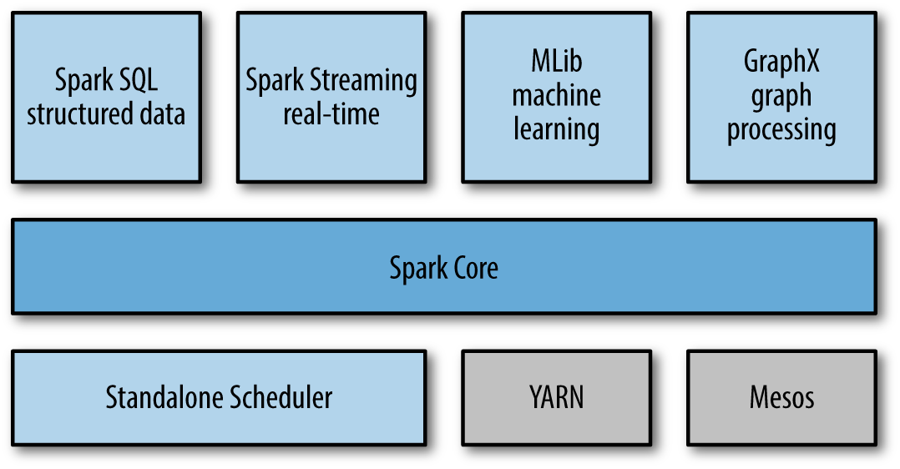

### Introduction to Data Analysis with Spark
#### What Is Apache Spark
- A cluster computing platform: *fast* and *general-purpose*
    - **Speed**
        - Extend the popular MapReduce model to efficiently support types of computations, including interactive queries and stream processing;
        - Run programs up to 100x faster than Hadoop MapReduce in memory, or 10x faster on disk
    - **Generality**
        - Cover a wide range of workloads
            batch applications, interactive algorithms, interactive queries, streaming
        - Easy and inexpensive to combine different processing types
        - Reduce the management burden of maintaining separate tools
- Highly accessible, simple APIs in Python, Java, Scala, and SQL, and rich built-in libraries
- Integrate closely with other Big Data tools
- Run in Hadoop clusters and access any Hadoop data source
#### A Unified Stack
- Spark's core is a "computational engine"
    - Schedule, distribute and monitor applications consisting of many computational tasks across many worker machines, or a *computing cluster*
- The core engine of Spark is both fast and general-purpose
    - Power multiple higher-level components specialized for various workloads, such as SQL or machine learning
- Components are designed to interoperate closely
- Benefits of tight integration
    - All libraries and higher-level components benefit from improvements at the lower layers
        - When core engine adds an optimization, SQL and machine learning libraries automatically speed up as well
    - The cost associated with running the stack are minimized
        - Instead of 5-10 independent software systems, only one is needed
        - These costs include deployment, maintenance, testing, support, and others
    - Build applications that seamlessly combine different processing models
        - Use machine learning to classify data in real time from streaming sources
        - Query the resulting data, also in real time, via SQL
- The Spark stack

- **Spark Core**
    - Basic functionality of Spark
        - Task scheduling, memory management, fault recovery, interacting with storage systems, and more
    - Home to the API that defines resilient distributed datasets(RDDs), which are Spark's main programming abstraction
        - RDDs: a collection of items distributed across many compute nodes that can be manipulated in parallel
    - Provide many APIs for building and manipulating these collections
- **Spark SQL**
    - Work with structured data
        - Query data via SQL as well as Hive
        - Support many sources of data, including Hive tables, Parquet, and JSON
    - Intermix SQL queries with the programmatic data manipulations supported by RDDs in Python, Java, and Scala
    - This tight integration makes Spark SQL unlike any other open source data warehouse tool
- **Spark Streaming**
    - Enable processing of live streams of data
        - Logfiles generated by production web servers
        - Queues of messages containing status updates from a web service
    - Data Streams API closely matches the Spark Core's RDD API
        - Easy to learn the project
        - Manipulate data stored in memory, on disk, or arriving in real time
    - Designed to provide fault tolerance, throughput, and scalability
- **MLlib**
    - A library containing common machine learning functionality, called MLlib, in spark.mllib package
    - Multiple types of machine learning algorithms
        - Classification
        - Regression
        - Clustering
        - Collaborative filtering
        - Functionality such as model evaluation and data input
    - Some lower-level ML primitives, including a generic gradient descent optimization algorithm
    - Spark 2.0 DataFrame based API, in spark.ml package
- **GraphX**
    - A library for manipulating graphs and performing graph-parallel computations
    - Extends the Spark RDD API, allowing us to create a directed graph with arbitrary properties attached to each vertex and edge
    - GraphX also provides various operators for manipulating graphs (e.g., subgraph and mapVertices) and a library of common graph algorithms (e.g., PageRank and triangle counting)
- **Cluster Managers**
    - Spark can run over a variety of cluster managers, including Hadoop YARN, Apache Mesos, and a simple cluster manager included in Spark itself called the Standalone Scheduler
### Who Uses Spark, and for what?
There are two groups it targets: data scientists and engineers. We can roughly classify use cases into two categories, *data science* and *data applications* .
#### Data Science tasks
- Data Science centers on analyzing data
    - Transform data into formats that can be analyzed for insights (sometimes referred to as data wrangling)
    - Use skills to analyze data with the goal of answering a question or discovering insights
- Spark supports the different tasks of data science with a number components
    - The Spark shell makes it easy to do interactive data analysis using Python or Scala
    - Spark SQL also has a separate SQL shell that can be used to do data exploration
    - Machine learning and data analysis is supported through the MLLib libraries
    - Spark enables data scientists to tackle problems with larger data sizes than they could before with tools like R or Pandas
#### Data Processing Applications
- Engineers use their engineering skills to design and build software systems that implement a business use case
- Spark provides a simple way to parallelize these applications across clusters, and hides the complexity of distributed systems programming, network communication, and fault tolerance
### Brief History
- park started in 2009 as a research project in the UC Berkeley RAD Lab, later to become the AMPLab. The researchers in the lab had previously been working on Hadoop MapReduce, and observed that MapReduce was inefficient for iterative and interactive computing jobs
- Spark was first open sourced in March 2010, and was transferred to the Apache Software Foundation in June 2013
### Storage Layers for Spark
- Spark can create distributed datasets from any file
    - Hadoop distributed filesystem (HDFS)
    - Other storage systems supported by the Hadoop APIs (including your local filesystem, Amazon S3, Cassandra, Hive, HBase, etc.)
- Spark does not require Hadoop; it simply has support for storage systems implementing the Hadoop APIs
- Spark supports text files, SequenceFiles, Avro, Parquet, and any other Hadoop InputFormat
